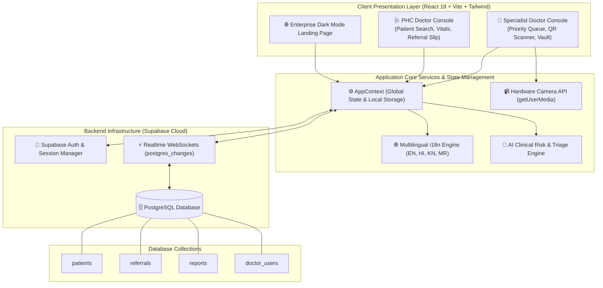
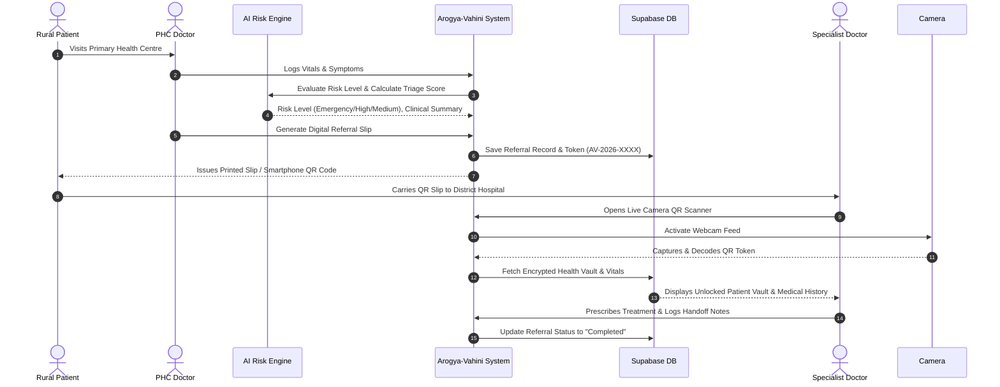

# 🏥 Arogya-Vahini (आरोग्य-वाहिनी • ಆರೋಗ್ಯ-ವಾಹಿನಿ)

> **"Bharat's Health, Our Priority."**  
> *Seamless Healthcare Bridge From Rural Care to Specialist Excellence.*

[](https://reactjs.org/)
[](https://vitejs.dev/)
[](https://www.typescriptlang.org/)
[](https://supabase.com/)
[](https://tailwindcss.com/)
[](https://opensource.org/licenses/MIT)

---

## 🌟 Overview

**Arogya-Vahini** is an AI-assisted rural referral network and digital health vault designed to eliminate paper-slip losses, repeated diagnostic tests, and delayed emergency transfers across primary healthcare centres in Bharat.

It seamlessly bridges **Primary Health Centres (PHCs)** in rural villages directly to **District Specialty Hospitals**, enabling instant scannable QR handoffs, AI-driven clinical risk triage, 4-language handoff reports (**English, Hindi, Kannada, Marathi**), and an encrypted **ABDM-aligned Health Vault**.

---

## 🏗️ System Architecture



---

## 🔄 Referral Continuum Data Flow



---

## 🧩 Architectural Modules Breakdown

### 1. 🌐 Client Presentation Layer
- **Framework**: React 18, Vite 5, TypeScript 5.
- **Routing**: Single Page Application (SPA) architecture with React Router v6.
- **Styling & Motion**: Tailwind CSS, CSS Custom Tokens, Framer Motion for micro-animations, Lucide React icons.

### 2. 🤖 AI Clinical Risk & Triage Engine
- **Vitals Evaluation**: Evaluates Systolic/Diastolic BP, Heart Rate, SpO2, Temperature, and Blood Glucose.
- **Multilingual Summary Generator**: Synthesizes clinical handoff summaries in **English, Hindi (हिंदी), Kannada (ಕನ್ನಡ), and Marathi (मराठी)**.

### 3. 📹 Hardware Camera Scanner Module
- **WebRTC / MediaDevices API**: Integrates `navigator.mediaDevices.getUserMedia({ video: { facingMode: 'environment' } })` for hardware webcam streaming.
- **Viewfinder Framing**: Animated laser target sweep with instant token verification upon detection or manual input.

### 4. 🗄️ Backend Infrastructure & Supabase Database
- **Database**: Supabase Cloud PostgreSQL with 4 relational tables (`patients`, `referrals`, `reports`, `doctor_users`).
- **Realtime Synchronization**: `postgres_changes` WebSocket channels push live inserts, updates, and referral completions to all connected doctor dashboards.
- **Authentication & Resilience**: Supabase Auth with automatic fallback provisioning for seamless demo and local authentication.

---

## ✨ Key Features

- **🌐 Enterprise Landing Page**: 5-section dark mode portal before login with role selector and CTAs.
- **📹 Auto-Start Camera QR Scanner**: Opens camera automatically on page load to scan printed referral QR codes in **< 1 second**.
- **🌐 Multilingual i18n Support**: Full page translation in **EN, HI, KN, MR** with prominent AIIMS-style Devanagari & Kannada top header box.
- **🔐 ABDM Health Vault**: Upload and store PDF lab reports, X-rays, and ECG scans attached to encrypted referral tokens.
- **💾 Save Login Info (Remember Me)**: Auto-fills stored credentials for 1-click doctor sign in.

---

## 🗄️ Database Schema

```sql
-- 1. Patients Table
CREATE TABLE public.patients (
    id VARCHAR(50) PRIMARY KEY,
    name VARCHAR(255) NOT NULL,
    age INT NOT NULL,
    gender VARCHAR(20) NOT NULL,
    mobile VARCHAR(20) NOT NULL,
    village VARCHAR(255) NOT NULL,
    address TEXT,
    blood_group VARCHAR(10) NOT NULL,
    history TEXT,
    created_at TIMESTAMP WITH TIME ZONE DEFAULT CURRENT_TIMESTAMP
);

-- 2. Referrals Table
CREATE TABLE public.referrals (
    id VARCHAR(50) PRIMARY KEY,
    token VARCHAR(100) UNIQUE NOT NULL,
    patient_id VARCHAR(50) REFERENCES public.patients(id) ON DELETE CASCADE,
    vitals JSONB NOT NULL,
    symptoms TEXT NOT NULL,
    diagnosis TEXT NOT NULL,
    priority VARCHAR(20) NOT NULL,
    hospital VARCHAR(255) NOT NULL,
    department VARCHAR(255) NOT NULL,
    reason TEXT NOT NULL,
    risk JSONB NOT NULL,
    summary JSONB NOT NULL,
    status VARCHAR(50) NOT NULL DEFAULT 'Active',
    created_at TIMESTAMP WITH TIME ZONE DEFAULT CURRENT_TIMESTAMP,
    created_by VARCHAR(255) NOT NULL,
    from_facility VARCHAR(255) NOT NULL,
    notes JSONB DEFAULT '[]'::jsonb,
    pdf_language VARCHAR(10) DEFAULT 'en'
);

-- 3. Reports Table (Health Vault Files)
CREATE TABLE public.reports (
    id VARCHAR(50) PRIMARY KEY,
    patient_id VARCHAR(50) REFERENCES public.patients(id) ON DELETE CASCADE,
    title VARCHAR(255) NOT NULL,
    kind VARCHAR(100) NOT NULL,
    facility VARCHAR(255) NOT NULL,
    date TIMESTAMP WITH TIME ZONE DEFAULT CURRENT_TIMESTAMP,
    file_url TEXT,
    file_name VARCHAR(255),
    file_type VARCHAR(50),
    file_size VARCHAR(50)
);

-- 4. Doctor Users Table
CREATE TABLE public.doctor_users (
    id VARCHAR(100) PRIMARY KEY,
    name VARCHAR(255) NOT NULL,
    role VARCHAR(20) NOT NULL,
    designation VARCHAR(255) NOT NULL,
    facility VARCHAR(255) NOT NULL,
    registration VARCHAR(100) NOT NULL
);
```

---

## 🚀 Getting Started Locally

### 1. Prerequisites
- Node.js (v18 or higher)
- npm or yarn

### 2. Installation Steps

1. **Clone the Repository**:
   ```bash
   git clone https://github.com/tarunram-commits/arogya.git
   cd arogya
   ```

2. **Install Dependencies**:
   ```bash
   npm install
   ```

3. **Configure Environment Variables**:
   Create a `.env` file in the root directory:
   ```env
   VITE_SUPABASE_URL=https://xllppukhwuxdvonfcokj.supabase.co
   VITE_SUPABASE_ANON_KEY=sb_publishable_cetI1zLsNvW3h4aq8lEY9w_s9d4IsPk
   ```

4. **Run Development Server**:
   ```bash
   npm run dev
   ```
   Open your browser at `http://localhost:5173/`.

---

## 📜 License

Distributed under the MIT License. See `LICENSE` for more information.

---

<p align="center">
  <b>Arogya-Vahini (आरोग्य-वाहिनी • ಆರೋಗ್ಯ-ವಾಹಿನಿ)</b> — <i>Bridging Rural Care to Specialist Excellence across Bharat 🇮🇳</i>
</p>
